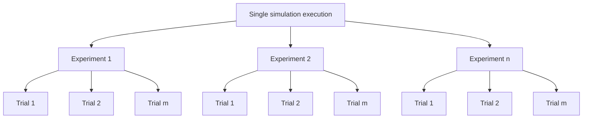
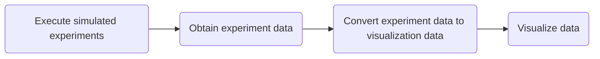

# Collective Perception with Imperfect Sensors
## Introduction
This repository provides the code to simulate collective perception experiments shown in [Minimalistic Collective Perception with Imperfect Sensors (accpeted to IROS 2023)](https://arxiv.org/abs/2209.12858).

Two simulators are provided here:
1. Python-based static topology simulator `collective_perception_static`, and
2. ARGoS-based dynamic topology simulator `collection_perception_dynamic`.

### Static topology simulation
The robots in the static topology simulator *do not move in the normal sense* and have fixed communication channels with its neighbors (the communication network is specified by the user). In each simulated experiment, a fixed number of robots would traverse their own black and white tile-track and communicate periodically with their neighbors. The figure below illustrates what it would look like for 4 robots in a ring topology.

<p align="center">

</p>

### Dynamic topology simulation
The robots in the dynamic topology simulator move around a square arena of black and white tiles. In each simulated experiment, a fixed number of robots would randomly move around the arena and communicate with neighbors within their proximity. The figure below is a screenshot of the simulation for 25 robots.

<p align="center">

</p>

### Benchmark algorithms
In addition to our collective perception algorithm, simulators for benchmark algorithms are also provided in this repository to provide performance comparison. They are simulated in a similar fashion to the dynamic topology simulator. See the [benchmark algorithm documentation](docs/benchmark_algo_explained.md) for more information.

## Requirements
### Local build
- Python 3.8+ and `pip`
- CMake 3.15+
- [ARGoS](https://github.com/ilpincy/argos3.git)
- [Buzz](https://github.com/NESTLab/Buzz)
- [ARGoS-KheperaIV plugin](https://github.com/ilpincy/argos3-kheperaiv) - *in this repository Khepera IVs are used, but with some modification to the experiment files you could potentially use other robot types*
- [Protobuf v3.6.1+ (`proto3`)](https://github.com/protocolbuffers/protobuf.git) - *can be installed using the `apt` package manager or built from source*
- [GraphTool v2.45+](https://graph-tool.skewed.de/) - *can be installed using the `apt` package manager*

### Container
- [Apptainer v1.0.2+](https://github.com/apptainer/apptainer)

## Installation
### Local build
The following instructions were tested on Ubuntu 20.04 LTS Focal Fossa. They may work on MacOS and Windows with some modification.
1. Ensure that all requirements are satisfied.
2. Clone the repository and go to the root directory.
    ```
    $ git clone https://github.com/khaiyichin/collective_perception.git
    $ cd collective_perception/
    ```
3. Run the `install` script (it builds `collective_perception_dynamic` and `collective_perception_static` under the hood).
    ```
    $ ./install.sh
    ```

### Container
The reason for using `apptainer` is the benefit of rootless execution (which is a problem for Docker containers), which permits usage of the simulators on HPC clusters. Another reason is due to the usage of GraphTool for the static simulator &mdash; installed using the `apt` package manager &mdash; which requires `sudo` privileges.

To create simulator containers, only `apptainer` is required; the other requirements will be installed as the containers are built. The containers are built in stages so that you can modify the `collective_perception*` source code anytime and only build the last level without having to start from the top.

1. Create a `containers` directory in the `apptainer` directory.
    ```
    $ cd apptainer && mkdir containers
    ```
2. Build the first image, which provides the ARGoS and Buzz base.
    ```
    $ sudo apptainer build argos_buzz_no_qt_base.sif ../def/argos_buzz_no_qt_base.def # no_qt indicates no QT support
    ```
    When the build finishes you should see the `argos_buzz_no_qt_base.sif` container.
3. Build the complete simulator image. This image can only be built on top of the first image layer that is named `argos_buzz_no_qt_base.sif`.
    ```
    $ sudo apptainer build multi_agent_sim_full_no_qt.sif ../def/multi_agent_sim_full_no_qt.def
    ```
    When the build finishes you should see the `multi_agent_sim_full_no_qt.sif` container.

## Execution
The instructions here describe scripts that provide a **single simulation execution**. In a single simulation execution, there can be multiple experiments, each of which may have repeated trials.

In general, simulation executions are controlled by two groups of parameters: an outer group and an inner group. The *outer parameter group is fixed for a single simulation execution*, i.e., the parameter values stay the same for all experiment and trials. The *inner parameter group is fixed only within an experiment*, i.e., the parameter values stay the same between the repeated trials of a single experiment, but vary across experiments.

The inner parameter group has two parameters: *target fill ratios* and *sensor probabilities*, and is the same for both simulation types. That is, a pair of target fill ratio and sensor probability values are used in one experiment. When the experiment (including the repeated trials) completes, a different pair of target fill ratio and sensor probability values is used in the next experiment.

The outer parameter group differs between the static and dynamic simulation types. For the static topology simulator, the parameters are *communication period* and *number of agents*; for the dynamic topology simulator, the parameters are *robot speed* and *swarm density*.

Ulitmately, a single simulation execution allows you to run different experiments (each with the amount of repeated trials that you desire) with different inner parameters. That is, by setting up a experiment configuration file once --- and then running a single simulation execution --- you get data from experiments with varying inner parameter values but with common outer parameter values.

The following instructions apply directly for the local build; for the container simulator simply prepend `apptainer exec multi_agent_sim_full_no_qt.sif` to the commands ([see the Apptainer documentation for more info](https://apptainer.org/docs/)).

### Static topology simulation
1. Set up the desired experimental parameters according as shown [here](docs/parameter_file_setup.md).
2. Activate the Python virtual environment (created in the `collective_perception_static` directory).
    ```
    $ cd collective_perception_static/
    $ source .venv/bin/activate
    ```
    *When running the container simulator, you can skip this step; there's no need to activate any virtual environment since the Python modules are installed directly to the container.*
3. Run the simulation (ensure that the parameter file is present in the execution directory).
    ```
    $ multi_agent_sim_static.py <PARAM-FILE>
    ```
    Script help:
    ```
    usage: multi_agent_sim_static.py [-h] [-p] FILE

    Execute multi-agent simulation with static topologies.

    positional arguments:
      FILE        path to the "param_multi_agent_sim_static.yaml" file relative to the current/execution directory

    optional arguments:
      -h, --help  show this help message and exit
      -p          flag to use cores to run simulations in parallel
    ```
4. When the execution completes, it will output pickled data in newly created directory `data`. (Dev note: pickles may be updated to protobufs; output directory structure may be modified.)

### Dynamic topology simulation
1. Set up the desired experimental parameters according as shown [here](docs/parameter_file_setup.md).
2. Run the simulation (ensure that the parameter file is present in the execution directory).
    ```
    $ run_dynamic_simulations -c param_multi_agent_sim_dynamic.argos
    ```
3. When the execution completes, it will output protobuf files in a local directory specified in your configuration file.

## Visualization of experiment data
Once the simulation execution completes, you will need to convert the output data into a `VisualizationDataGroup` type data file. The workflow looks like the following:

See the [here](docs/scripts_explained.md) for detailed instructions, but the general idea is:
1. Convert the experiment data with the `convert_exp_data_to_viz_data_group.py` script (static) or `convert_sim_stats_set_to_viz_data_group.py` script (dynamic).
2. Visualize the converted data with the `visualize_multi_agent_data_*.py`.

## Testing
Unit tests have been provided to aid any updates to the source code. Besides identifying the kinds of testing imposed on the source code, looking into the test files can help you understand how the algorithm works.

For the static simulator, simply do the following to run tests after the virtual environment has been setup.
```
$ cd collective_perception_static
$ source .venv/bin/activate
$ pytest --workers=<N> # run the test in parallel using N cores; remove the "--workers" flag if sequential testing is desired
```

For the dynamic simulator, you will need to clone this repository including its submodules, notably the [Catch2](https://github.com/catchorg/Catch2/) repository in `collective_perception_dynamic/extern/`.
```
$ git clone --recurse-submodules https://github.com/khaiyichin/collective_perception.git
```
Build the dynamic simulator project in `Debug` mode.
```
$ cd collective_perception_dynamic
$ mkdir build && cd build
$ cmake -DCMAKE_BUILD_TYPE=Debug ..
...
$ make -j$(nproc)
```
Then you can run the tests by either doing `make test` or executing them with the command line.
```
# Run without any flags, see the Catch2 documentation for more info
$ tests/tests

# Run with gdb
$ gdb tests/tests # or gdb --args tests/tests <ARGS> if you have arguments, e.g., Catch2 flags

# Run with valgrind
$ valgrind tests/tests <ARGS-IF-ANY>
```

### Additional testing notes
To provide the ability to compute Beta CDF values required by one of the benchmark algorithms, the `custom_beta_cdf_gsl.*pp` implmentation is provided, ported from GSL. Subsequently, a test script has been created to ensure that the porting process was correct, which can be executed by doing the following.
```
$ tests/test_custom_beta_cdf_gsl
```